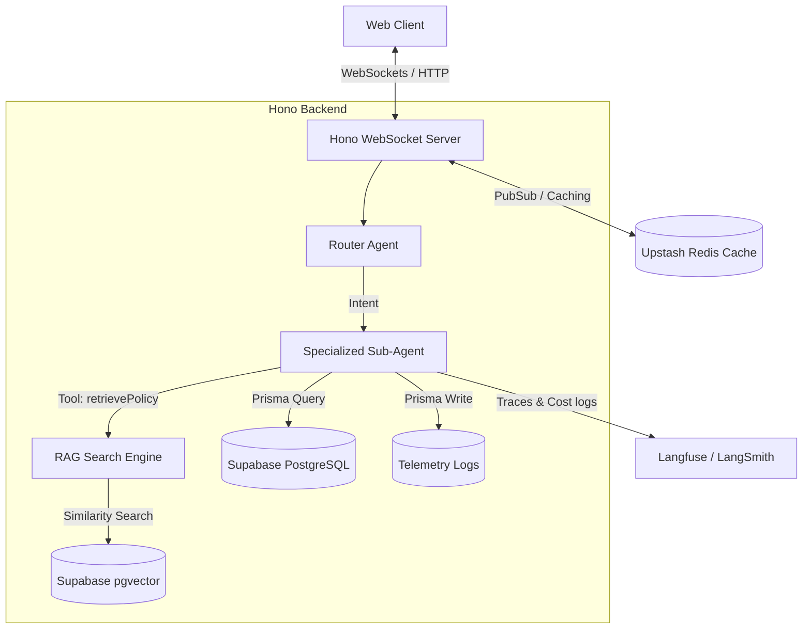

# 🚀 AgentDesk: System Architecture & Advanced Feature Roadmap

This document serves as the **Master System Specification and Feature Roadmap** to elevate **AgentDesk** into a world-class, production-ready enterprise customer support system. It is designed to demonstrate deep architectural knowledge and production readiness to senior engineering interviewers.

---

## 🏗️ Current vs. Target Tech Stack

To support high performance, real-time sync, observability, and smooth local onboarding, we are upgrading the architecture:

| Component | Current Stack | Target Stack (Upgrades) | Purpose |
|---|---|---|---|
| **Database** | PostgreSQL (Supabase) | PostgreSQL + **pgvector** | Native vector storage for semantic retrieval (RAG). |
| **Caching** | Redis (Upstash) | Redis + **Redis Pub/Sub** | Horizontal scaling of WebSocket connections. |
| **Observability** | Console logs | **Langfuse / LangSmith** | Telemetry tracking, latency auditing, and token cost tracking. |
| **Real-time API** | HTTP POST | **WebSockets (ws)** | Instant chat synchronization, typing states, and live handoff. |
| **Testing** | Manual sandbox seeding | **Vitest + Playwright** | Unit, integration, and E2E browser testing suites. |
| **Containerization** | None | **Docker & Docker Compose** | Standardized local environment containing Postgres + pgvector, Redis, frontend, and backend. |
| **CI/CD** | Manual deploy | **GitHub Actions CI Pipeline** | Automated linting, Prisma checks, and test runner on every PR/push. |

---

## 🗺️ System Architecture Diagram



---

## 🛠️ DevOps & Infrastructure Specifications

### 1. Monorepo Dockerization
To eliminate "it works on my machine" issues, the repository will support automated local orchestration:
* **Multi-stage Dockerfiles**: Separate builds for frontend (Next.js) and backend (Hono), using Node-alpine bases optimized for small size.
* **Orchestration (`docker-compose.yml`)**: Spins up:
  - `postgres` container initialized with `pgvector`.
  - `redis` container.
  - `backend` running Hono.
  - `frontend` running Next.js.

### 2. GitHub Actions CI/CD Pipeline
An automated workflow (`.github/workflows/ci.yml`) will enforce quality on every code push or Pull Request:
* **Prisma Checks**: Verifies that schema transitions are valid (`prisma validate`) and files are formatted.
* **Type Safety Check**: Compiles the TypeScript projects to catch compilation errors.
* **Automated Testing**: Launches a headless Postgres test instance, runs migrations, and triggers all Vitest tests.

---

## 📋 Consolidated Execution Phases

All three AI models (Gemini, Claude Sonnet, and Claude Opus) have evaluated the roadmap and locked in this sequential build order to minimize risk and maximize delivery velocity.

### Phase 1: Zero-Setup Demo Mode & Smart Suggested Prompts
* **Goal**: Enable interviewers and guests to test the app instantly without signing up or manually seeding data.
* **Interactive Demo Mode**: A `"Try Demo"` button on the login screen. It auto-creates or logs into a test account pre-populated with:
  - 5 orders of various statuses (`Processing`, `Shipped`, `Delivered`, `Return Initiated`, `Cancelled`).
  - 4 payments mapped to these orders.
  - Previous message history to demonstrate session persistence.
* **Smart Suggested Prompts**: High-impact clickable chips in empty chat screens customized dynamically using the user's data (e.g., if a user has a delivered order within the 7-day return window, show a chip saying: *"Return my iPhone 15"*).

### Phase 2: Production-Grade RAG (Knowledge Base via pgvector)
* **Goal**: Retrieve business rules dynamically instead of hardcoding policies inside LLM prompts.
* **KnowledgeBase Schema**: A table storing support documentation and FAQ sections, including native vector embeddings columns.
* **Semantic Search**: Set up `pgvector` inside Supabase and write a document embedding ingestion script using a free local transformer library (`@xenova/transformers`) to generate 384-dimensional vectors.
* **Agent Integration**: Hook up a `retrievePolicy` tool. When questions about return guidelines or delivery times are asked, the agent queries the vector database first to fetch the correct context.

### Phase 3: Agent Observability & Telemetry (The "Flight Recorder")
* **Goal**: Solve the AI "Black Box" problem by making agent traces fully auditable.
* **Telemetry logging**: A `MessageTelemetry` model storing intent classifications, model names, latency breakdowns, prompt/completion tokens, raw compiled prompts, and raw JSON user context.
* **Dev Drawer UI**: A developer toggle in the header. When enabled, each chat bubble has an "Inspect Trace" icon. Clicking it slides open a drawer displaying the prompt diff, latency flowchart, and estimated LLM cost.

### Phase 4: Agent Memory (Cross-Session User Facts)
* **Goal**: Enable the agents to remember user preferences and facts across different chat sessions.
* **Stateful UserMemory**: A table mapping key-value facts (e.g., `preferred_refund: wallet`, `device_brand: iOS`).
* **Tool-based Updates**: Hook up `readMemory` and `writeMemory` tools to the agents, letting them read existing facts at start-up and update them dynamically during the chat.

### Phase 5: Guardrail Evaluation Suite
* **Goal**: Prevent regressions, prompt injections, and policy bypasses during agent updates.
* **Eval Pipeline**: Create a script running 20+ adversarial test cases (e.g. attempting to cancel delivered orders, prompt injection attacks).
* **Metrics Dashboard**: Display a developer analytics screen showing **Pass/Fail rate**, average response time, and classification accuracy.

### Phase 6: Human-in-the-Loop (HITL) Handoff & Sentiment Escalation
* **Goal**: Gracefully escalate a conversation to a human agent when the AI is stuck or the user is frustrated.
* **Sentiment Scorer**: Run a fast sentiment check (positive/negative/neutral) on user inputs. If 3 consecutive negative messages are detected, prompt: *"Would you like me to connect you to a human agent?"*
* **Escalation & Handoff**: Update the `Conversation` status to `HUMAN_REQUIRED`. Disable LLM processing for this session, open a WebSocket connection to a mock `/admin` support dashboard, and let a simulated human agent take over the chat.

### Phase 7: Multi-Step Workflows
* **Goal**: Support complex queries requiring multiple sequential actions (e.g., *"Cancel my laptop order and check when my return refund will clear"*).
* **Fan-out Orchestration**: The router decomposes the query into sub-intents, fires parallel agent streams, and synthesizes the sub-agent responses into a single output.

### Phase 8: Containerization & CI/CD Pipelines
* **Goal**: Enable seamless setup and deployment testing for third-party contributors or interviewers.
* **Implementation**: Implement the multi-stage Docker build pipeline and set up the GitHub Actions workflow to run automatic test checks.

---

## 🗄️ Database Schemas (Drafts)

### 1. RAG Knowledge Base (`schema.prisma`)
```prisma
model KnowledgeBase {
  id        String                    @id @default(uuid())
  title     String
  content   String
  category  String                    // "Return", "Cancellation", "Shipping", "General"
  embedding Unsupported("vector(384)")? // pgvector embedding column for local transformers
  createdAt DateTime                  @default(now())
}
```

### 2. Message Telemetry (`schema.prisma`)
```prisma
model MessageTelemetry {
  id              String   @id @default(uuid())
  messageId       String   @unique
  message         Message  @relation(fields: [messageId], references: [id])
  
  intent          String   // "ORDER", "BILLING", "SUPPORT"
  routingTimeMs   Int
  llmModel        String   // "llama-3.1-8b"
  llmTimeMs       Int
  promptTokens    Int
  completionTokens Int
  rawSystemPrompt String
  rawUserContext  String
  parsedAction    String?
  createdAt       DateTime @default(now())
}
```

### 3. Agent Memory (`schema.prisma`)
```prisma
model UserMemory {
  id        String   @id @default(uuid())
  userId    String
  user      User     @relation(fields: [userId], references: [id])
  key       String   // e.g. "preferred_refund"
  value     String   // e.g. "wallet"
  updatedAt DateTime @updatedAt
  createdAt DateTime @default(now())

  @@unique([userId, key])
}
```
