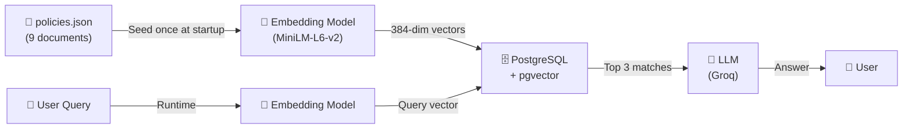
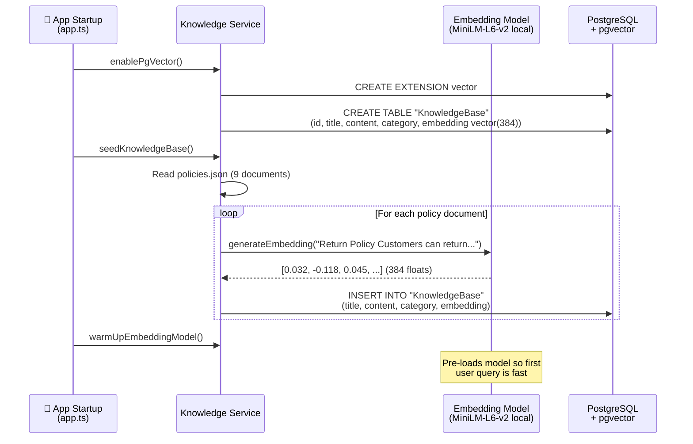
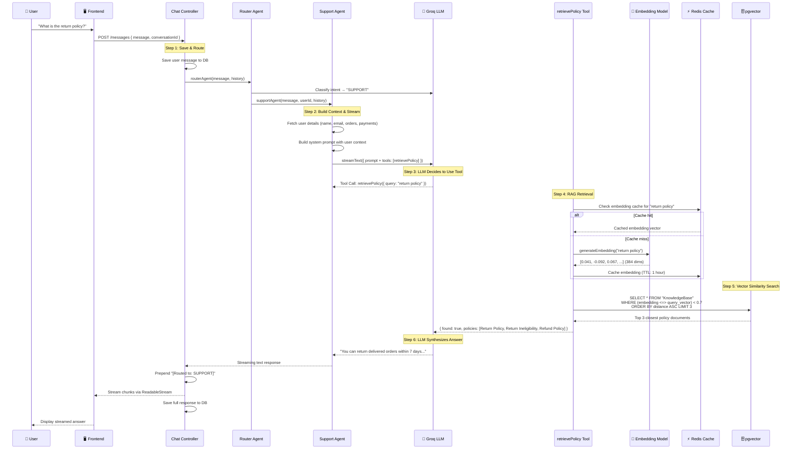
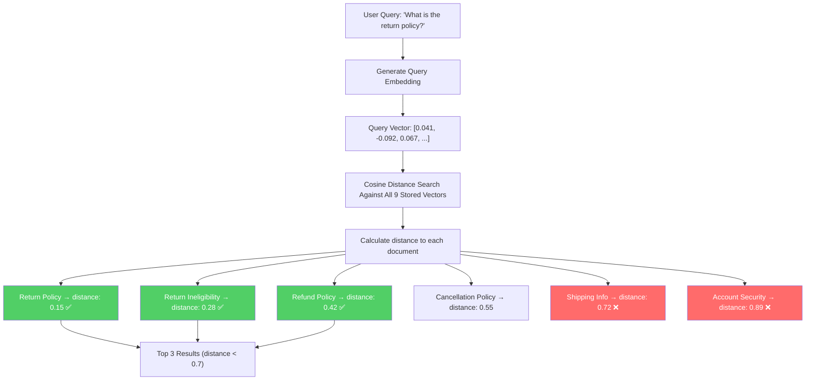
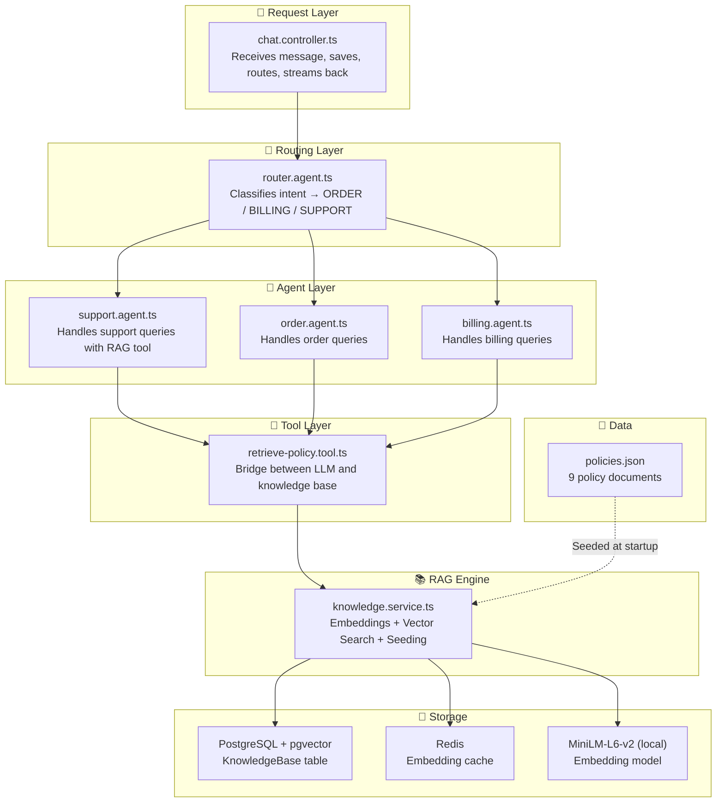

# AgentDesk — Complete RAG Flow

## High-Level Overview



---

## Phase 1: Knowledge Base Seeding (One-Time at Startup)

This happens once when the server boots — populates the vector database with policy documents.



### Source Files

| File | Role |
|------|------|
| [policies.json](file:///c:/Users/ASUS/Desktop/Project/agentDesk/apps/backend/src/data/policies.json) | 9 raw policy documents (Return, Cancellation, Shipping, Refund, Billing, Security, Escalation) |
| [knowledge.service.ts](file:///c:/Users/ASUS/Desktop/Project/agentDesk/apps/backend/src/services/knowledge.service.ts) → [seedKnowledgeBase()](file:///c:/Users/ASUS/Desktop/Project/agentDesk/apps/backend/src/services/knowledge.service.ts#L103-L139) | Reads JSON, generates embeddings, inserts into pgvector |
| [knowledge.service.ts](file:///c:/Users/ASUS/Desktop/Project/agentDesk/apps/backend/src/services/knowledge.service.ts) → [enablePgVector()](file:///c:/Users/ASUS/Desktop/Project/agentDesk/apps/backend/src/services/knowledge.service.ts#L142-L166) | Creates the pgvector extension and KnowledgeBase table |

### What Gets Stored

```
┌──────────────────────────────────────────────────────────────────┐
│                    KnowledgeBase Table (pgvector)                │
├──────────┬─────────────────┬──────────────┬─────────────────────┤
│ id (PK)  │ title           │ category     │ embedding           │
├──────────┼─────────────────┼──────────────┼─────────────────────┤
│ uuid-1   │ Return Policy   │ Return       │ [0.03, -0.11, ...]  │
│ uuid-2   │ Return Inelig.  │ Return       │ [0.05, -0.08, ...]  │
│ uuid-3   │ Cancellation    │ Cancellation │ [-0.02, 0.14, ...]  │
│ uuid-4   │ Shipping Info   │ Shipping     │ [0.07, -0.03, ...]  │
│ uuid-5   │ Delayed Order   │ Shipping     │ [0.01, 0.09, ...]   │
│ uuid-6   │ Refund Policy   │ General      │ [-0.04, 0.12, ...]  │
│ uuid-7   │ Payment Methods │ General      │ [0.06, -0.07, ...]  │
│ uuid-8   │ Account Security│ General      │ [0.02, 0.05, ...]   │
│ uuid-9   │ Escalation      │ General      │ [-0.01, 0.03, ...]  │
└──────────┴─────────────────┴──────────────┴─────────────────────┘
                              384 dimensions per vector
```

---

## Phase 2: Runtime Query Flow (Every User Message)

This is the full journey of a user question like *"What is the return policy?"*



---

## Phase 3: Vector Search Details

### How Similarity Search Works



### Search Parameters

| Parameter | Value | Purpose |
|-----------|-------|---------|
| Distance metric | Cosine (`<=>`) | Measures angle between vectors |
| Max distance | `0.7` | Filters out irrelevant docs (closer to 0 = more similar) |
| Limit | `3` | Returns top 3 most relevant documents |
| Vector dimensions | `384` | MiniLM-L6-v2 output size |

> [!NOTE]
> Relevance score shown to the LLM is `1 - distance`, so a distance of `0.15` becomes a relevance score of `0.850` (85% relevant).

---

## Component Map (File → Responsibility)



---

## Key Design Decisions

| Decision | What | Why |
|----------|------|-----|
| **Local embedding model** | MiniLM-L6-v2 runs on the server, not via API | Zero cost, no API key needed, no network latency |
| **pgvector** | PostgreSQL extension for vector search | Reuses existing Postgres, no separate vector DB |
| **Redis caching** | Embedding vectors cached for 1 hour | Same queries don't re-compute embeddings |
| **LLM-controlled retrieval** | LLM decides WHEN to call the tool | Avoids unnecessary KB lookups for greetings/chitchat |
| **384 dimensions** | MiniLM-L6-v2 output size | Good balance of quality vs storage/speed |
| **Cosine distance < 0.7** | Relevance threshold | Prevents returning irrelevant documents |
| **Top 3 results** | Limit on returned docs | Keeps LLM context small and focused |
